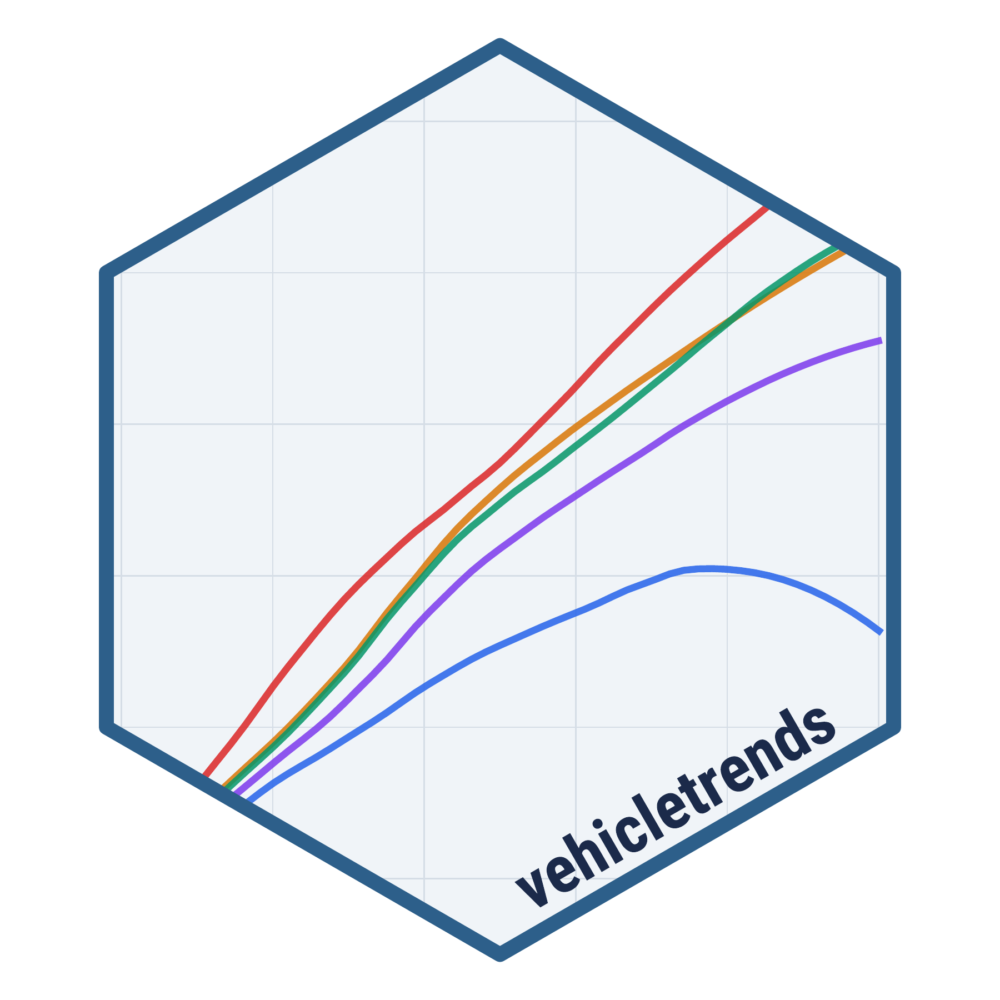

<!-- README.md is generated from README.Rmd. Please edit that file -->

```{r, include = FALSE}
knitr::opts_chunk$set(
  collapse = TRUE,
  warning = FALSE,
  message = FALSE,
  comment = "#>",
  fig.path = "man/figures/README-",
  fig.retina = 3
)
```

# vehicletrends <a href='https://pkg.vehicletrends.us/'></a>

<!-- badges: start -->
<!-- badges: end -->

An R data package containing tidy formatted summary data on vehicle trends in the United States. The primary data source is vehicle listings from [marketcheck.com](https://www.marketcheck.com/), which have been processed into summary statistics including depreciation curves, mileage accumulation, market concentration, and market share breakdowns.

For a live dashboard of the data, visit [vehicletrends.us](https://vehicletrends.us).

## Installation

You can install vehicletrends from GitHub:

```{r}
#| eval: false

# install.packages("remotes")
remotes::install_github("vehicletrends/vehicletrends")
```

## Usage

```{r}
library(vehicletrends)
```

Once loaded, all datasets are available directly by name. See the [datasets article](https://pkg.vehicletrends.us/articles/datasets.html) for detailed data dictionaries.

## Datasets

| Dataset | Description |
|:----------|:------------------------------------------------|
| `vmt_age` | Cumulative odometer mileage quantiles by age, powertrain, and vehicle type |
| `vmt_daily` | Daily vehicle miles traveled quantiles by powertrain and vehicle type |
| `vmt_annual_type` | Estimated annual VMT by powertrain and vehicle type |
| `vmt_annual_model` | Estimated annual VMT by make and model |
| `depreciation` | Retention rate quantiles for used vehicles by age, powertrain, and vehicle type |
| `dep_annual_type` | Estimated annual depreciation rate by powertrain and vehicle type |
| `dep_annual_model` | Estimated annual depreciation rate by make and model |
| `percent_market` | Market share proportions across powertrain, vehicle type, and price bin |
| `registrations` | Annual vehicle registration counts by US state and powertrain type (2016--2024) |