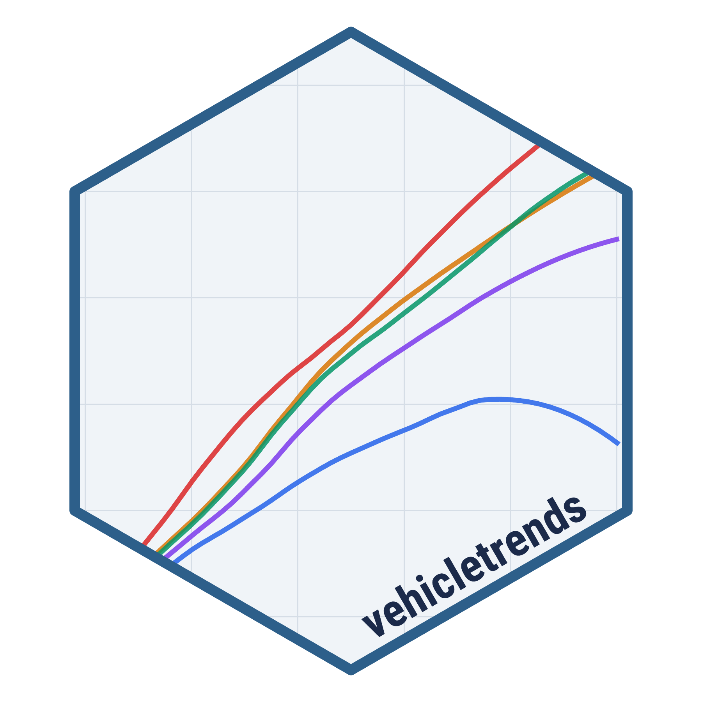

<!-- README.md is generated from README.Rmd. Please edit that file -->

# vehicletrends <a href='https://pkg.vehicletrends.us/'></a>

<!-- badges: start -->

<!-- badges: end -->

An R data package containing tidy formatted summary data on vehicle
trends in the United States. The primary data source is vehicle listings
from [marketcheck.com](https://www.marketcheck.com/), which have been
processed into summary statistics including depreciation curves, mileage
accumulation, market concentration, and share of listings breakdowns.

For a live dashboard of the data, visit
[vehicletrends.us](https://vehicletrends.us).

## Installation

You can install vehicletrends from GitHub:

``` r
# install.packages("remotes")
remotes::install_github("vehicletrends/vehicletrends")
```

## Usage

``` r
library(vehicletrends)
```

Once loaded, all datasets are available directly by name. See the
[datasets article](https://pkg.vehicletrends.us/articles/datasets.html)
for detailed data dictionaries.

## Datasets

| Dataset | Description |
|:---|:---|
| `vmt_age` | Cumulative odometer mileage quantiles by age, powertrain, and vehicle type |
| `vmt_daily` | Daily vehicle miles traveled quantiles by powertrain and vehicle type |
| `vmt_annual_type` | Estimated annual VMT by powertrain and vehicle type |
| `vmt_annual_model` | Estimated annual VMT by make and model |
| `depreciation` | Retention rate quantiles for used vehicles by age, powertrain, and vehicle type |
| `dep_annual_type` | Estimated annual depreciation rate by powertrain and vehicle type |
| `dep_annual_model` | Estimated annual depreciation rate by make and model |
| `percent_listings` | Share of vehicle listings across powertrain, vehicle type, and price bin |
| `percent_dealers` | Percentage of dealers with at least one listing by variable pairs |
| `hhi_local_summary` | Local market HHI (measure of market concentration) summary statistics across all US census tracts (local market defined as dealers within 60 minute isocrhone) |
| `p_local_summary` | Local market share of listings summary statistics across all US census tracts (local market defined as dealers within 60 minute isocrhone) |
| `registrations` | Annual vehicle registration counts by US state and powertrain type (2016–2024) |

## Large Raw Data Files

The following large files are hosted on Cloudflare R2 and can be
downloaded directly. The `hhi_*` and `p_*` parquet files are the
census-tract-level source data used to compute the `hhi_local_summary`
and `p_local_summary` package datasets. File name suffixes indicate the
grouping variable (`pb` = price bin, `pt` = powertrain, `vt` = vehicle
type) and isochrone radius (`60` = 60-minute drive time).

| File | Description |
|:---|:---|
| [hhi_pb_60.parquet](https://pub-17d608be304c4976845ab692fc09de91.r2.dev/hhi_pb_60.parquet) | HHI per census tract, grouped by price bin (60-min isochrone) |
| [hhi_pt_60.parquet](https://pub-17d608be304c4976845ab692fc09de91.r2.dev/hhi_pt_60.parquet) | HHI per census tract, grouped by powertrain (60-min isochrone) |
| [hhi_vt_60.parquet](https://pub-17d608be304c4976845ab692fc09de91.r2.dev/hhi_vt_60.parquet) | HHI per census tract, grouped by vehicle type (60-min isochrone) |
| [p_pb_60.parquet](https://pub-17d608be304c4976845ab692fc09de91.r2.dev/p_pb_60.parquet) | Market share (p) per census tract, grouped by price bin (60-min isochrone) |
| [p_pt_60.parquet](https://pub-17d608be304c4976845ab692fc09de91.r2.dev/p_pt_60.parquet) | Market share (p) per census tract, grouped by powertrain (60-min isochrone) |
| [p_vt_60.parquet](https://pub-17d608be304c4976845ab692fc09de91.r2.dev/p_vt_60.parquet) | Market share (p) per census tract, grouped by vehicle type (60-min isochrone) |
| [tracts.rds](https://pub-17d608be304c4976845ab692fc09de91.r2.dev/tracts.rds) | US census tract geometries (full resolution) |
| [tracts_simplified.rds](https://pub-17d608be304c4976845ab692fc09de91.r2.dev/tracts_simplified.rds) | US census tract geometries (simplified for faster rendering) |
| [hhi_tracts.pmtiles](https://pub-17d608be304c4976845ab692fc09de91.r2.dev/hhi_tracts.pmtiles) | HHI per census tract as PMTiles for interactive map visualization |

## Citation information

If you use this package in a publication, please cite it! You can get
the citation by typing `citation("vehicletrends")` into R:

``` r
citation('vehicletrends')
#> To cite vehicletrends in publications use:
#> 
#>   John Paul Helveston (2026). vehicletrends: Data on Vehicle Trends in
#>   the USA. R package version 0.0.3.
#>   https://github.com/vehicletrends/vehicletrends
#> 
#> A BibTeX entry for LaTeX users is
#> 
#>   @Manual{,
#>     title = {vehicletrends: Data on Vehicle Trends in the USA},
#>     author = {John Paul Helveston},
#>     year = {2026},
#>     note = {R package version 0.0.3},
#>     url = {https://github.com/vehicletrends/vehicletrends},
#>   }
```
